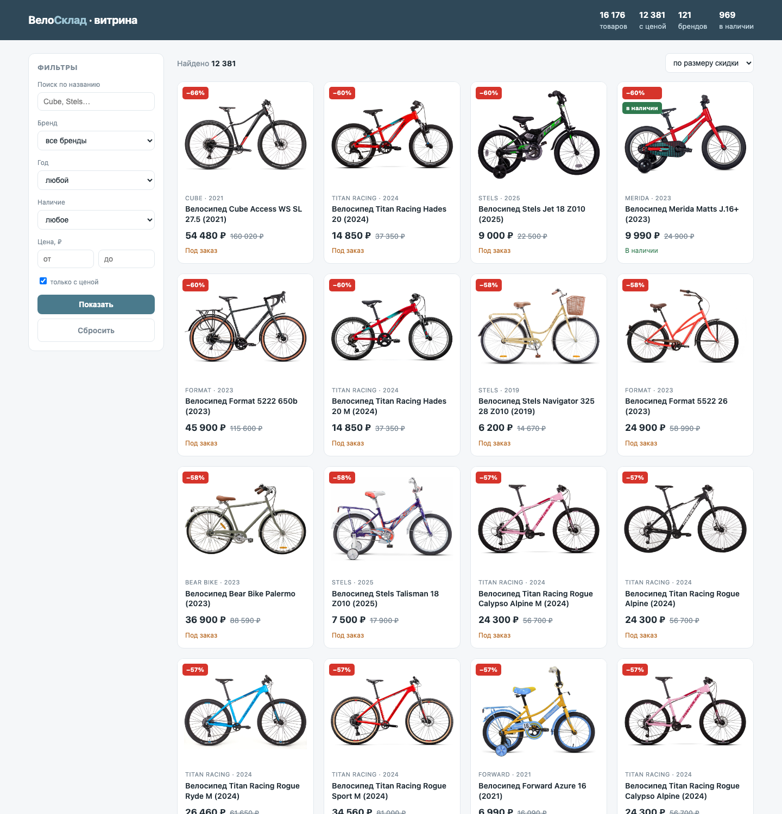
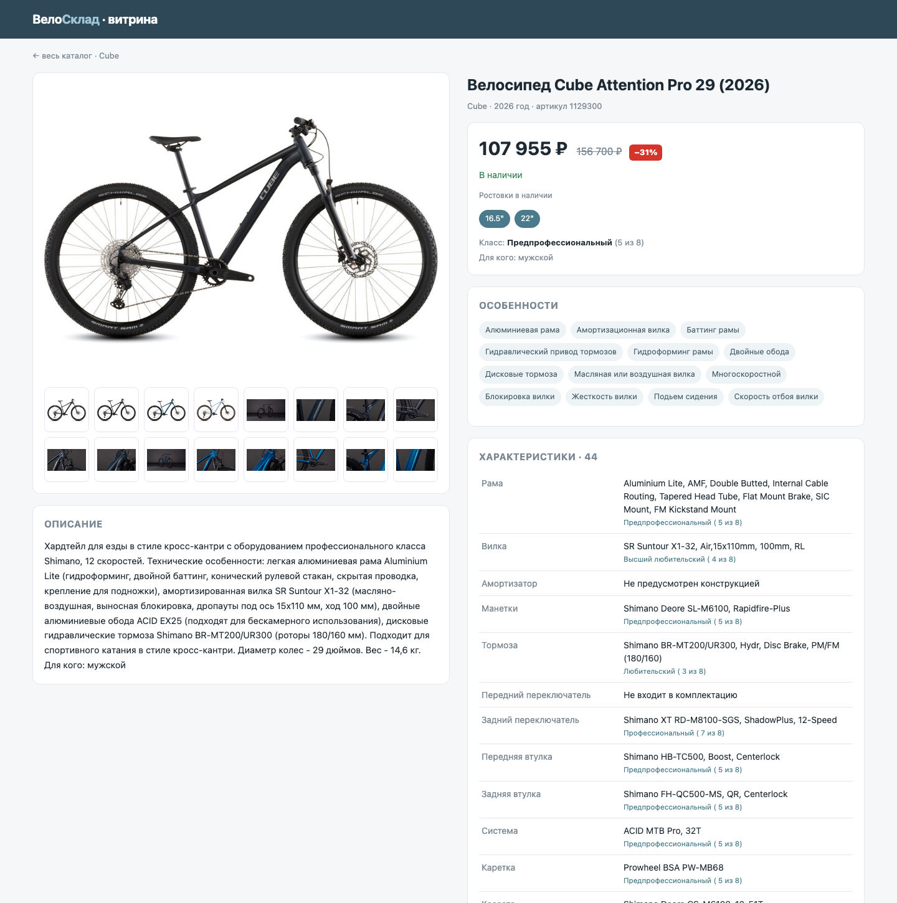
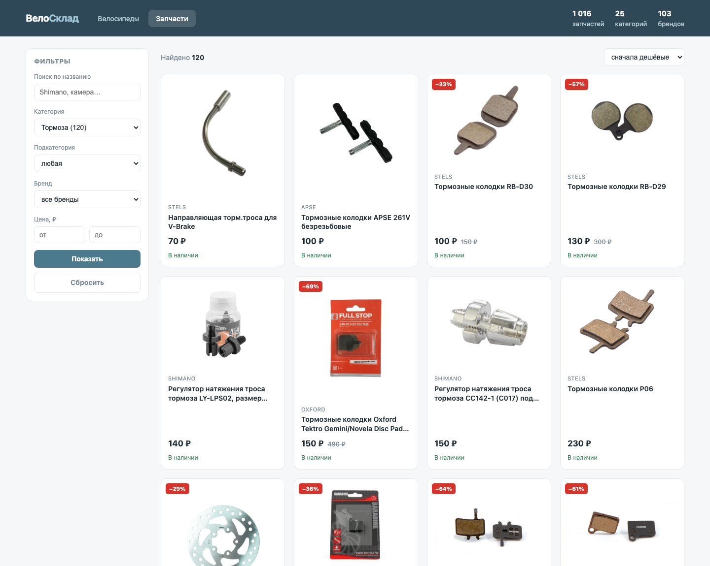
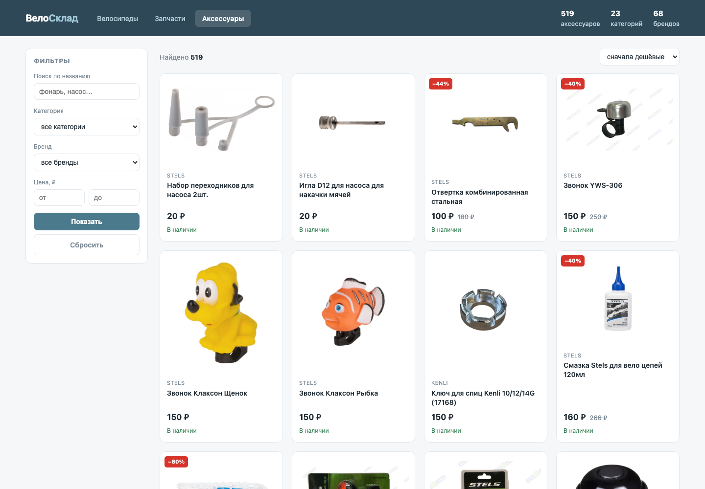
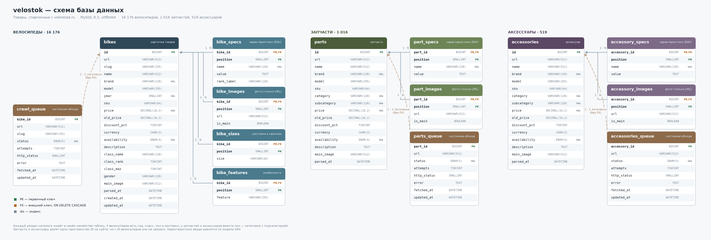

# velostok — витрина каталога велосипедов, запчастей и аксессуаров

Веб-витрина по каталогу: **16 176 велосипедов**, **1 016 запчастей** и **519 аксессуаров**
с ценами, характеристиками и фото. В репозитории лежит готовый дамп данных, поэтому для запуска
ничего парсить не нужно — достаточно поднять MySQL, залить дамп и запустить сервер.



## Что внутри

| | |
|---|---|
| `web/` | Flask-приложение витрины: каталог с фильтрами и карточка товара |
| `sql/velostok_data.sql.gz` | Дамп данных (6.8 МБ сжатый, ~120 МБ развёрнутый) |
| `sql/schema.sql` | Справочный DDL таблиц велосипедов |
| `sql/parts_schema.sql` | Справочный DDL таблиц запчастей |
| `sql/accessories_schema.sql` | Справочный DDL таблиц аксессуаров |
| `scripts/er_diagram.py` | Генератор ER-схемы базы в PNG |
| `db_schema.png` | Готовая схема базы |

Кода парсера в этом репозитории нет — только собранные им данные и витрина поверх них.

## Требования

- Python 3.10+
- MySQL 8.0+ (проверялось на 9.3)

## Запуск: шаг за шагом

### 1. Клонировать репозиторий

```bash
git clone https://github.com/Eliseev88/velostok.git
cd velostok
```

### 2. Создать виртуальное окружение и поставить зависимости

```bash
python3 -m venv .venv
.venv/bin/pip install -r requirements.txt
```

### 3. Убедиться, что MySQL запущен

```bash
mysql --version                    # клиент на месте?
mysqladmin -u root status          # сервер отвечает?
```

Если сервер не поднят — запусти его: `brew services start mysql` (macOS)
или `sudo systemctl start mysql` (Linux).

### 4. Создать базу данных

```bash
mysql -u root -e "CREATE DATABASE velostok CHARACTER SET utf8mb4 COLLATE utf8mb4_unicode_ci;"
```

Если у твоего `root` есть пароль, добавляй к командам `mysql` флаг `-p`.

### 5. Залить дамп с товарами

```bash
gunzip -c sql/velostok_data.sql.gz | mysql -u root velostok
```

Занимает около 20 секунд. Дамп сам создаёт все нужные таблицы — отдельно применять
`sql/schema.sql` не требуется.

Проверить, что данные на месте:

```bash
mysql -u root velostok -e "SELECT COUNT(*) FROM bikes;"     # ожидается 16176
```

### 6. Указать доступы к базе

```bash
cp .env.example .env
```

Значения по умолчанию (`root` без пароля на `127.0.0.1:3306`, база `velostok`) подходят
для типовой локальной установки. Если у тебя иначе — поправь `.env`.

### 7. Запустить витрину

```bash
.venv/bin/python -m web.app
```

Открыть в браузере: **http://127.0.0.1:5001**

## Что умеет витрина

Три раздела, переключаются в шапке: **Велосипеды**, **Запчасти** и **Аксессуары**.

Каталог велосипедов — фильтры по бренду, году, наличию и диапазону цен, поиск по названию,
пять сортировок и пагинация. В карточке товара галерея с переключением по наведению,
цена со скидкой, ростовки в наличии, класс велосипеда, особенности и полный список
характеристик с оценкой класса каждого узла.



Каталоги запчастей и аксессуаров устроены одинаково — фильтры по категории и подкатегории
(подкатегории появляются после выбора категории), бренду и цене. В карточке — галерея,
цена со скидкой и характеристики.





Фотографии не хранятся локально — в базе лежат ссылки на `velosklad.ru`, и браузер
подгружает их напрямую. Поэтому для картинок нужен интернет.

## Схема базы



Главная таблица — `bikes`, одна строка на товар. Характеристики вынесены в `bike_specs`
по модели EAV: их набор плавает от 8 до 50 у разных товаров и под фиксированные колонки
не сводится. Фото, ростовки и особенности лежат в своих таблицах, все — с каскадным
удалением по `bike_id`.

Запчасти и аксессуары живут в своих семействах таблиц (`parts` / `part_specs` /
`part_images` и `accessories` / `accessory_specs` / `accessory_images`). У них нет года,
класса, пола и ростовок, зато есть категория с подкатегорией. Между собой запчасти и
аксессуары делят одно пространство ID (на сайте это соседние разделы одного каталога),
но с ID велосипедов оно не связано — поэтому общей таблицы нет.

Таблицы `crawl_queue`, `parts_queue` и `accessories_queue` относятся к парсеру, которого
в этом репозитории нет, и в дамп не входят — витрине они не нужны.

Пересобрать схему в PNG (например, после изменения структуры):

```bash
.venv/bin/python scripts/er_diagram.py db_schema.png
```

## Что в данных

**Велосипеды**

| Показатель | Значение |
|---|---|
| Товаров | 16 176 |
| С ценой | 12 381 (76.5%) |
| Брендов | 121 |
| Характеристик | 546 748 (в среднем 33.8 на товар) |
| Ссылок на фото | 169 911 |
| Наличие | 969 `in_stock`, 11 412 `out_of_stock`, 3795 `unknown` |
| Годы моделей | 2016–2027 |

Статус `unknown` — архивные модели, снятые с продажи: у них нет цены и наличия,
но характеристики и фото собраны полностью.

**Запчасти**

| Показатель | Значение |
|---|---|
| Товаров | 1 016 |
| С ценой | 1 016 (100%) |
| Категорий | 25 |
| Брендов | 103 |
| Характеристик | 8 771 |
| Ссылок на фото | 3 726 |

Крупнейшие категории — тормоза (120), переключатели и манетки (119), камеры (86).
У 91 запчасти не указан бренд: в карточке его попросту нет.

**Аксессуары**

| Показатель | Значение |
|---|---|
| Товаров | 519 |
| С ценой | 519 (100%) |
| Категорий | 23 |
| Брендов | 68 |
| Характеристик | 4 994 |
| Ссылок на фото | 5 356 |

Крупнейшие категории — крылья (106), велофонари (97), инструменты (45), велозамки (43).
Все позиции в наличии.

## Полезные запросы

```sql
-- бренды по количеству моделей и среднему чеку
SELECT brand, COUNT(*) n, ROUND(AVG(price)) avg_price FROM bikes
 WHERE price IS NOT NULL GROUP BY brand ORDER BY n DESC LIMIT 20;

-- самые большие скидки
SELECT name, old_price, price, discount_pct FROM bikes
 WHERE discount_pct IS NOT NULL ORDER BY discount_pct DESC LIMIT 10;

-- характеристики конкретного товара
SELECT name, value FROM bike_specs WHERE bike_id = 29300 ORDER BY position;

-- что реально в наличии
SELECT id, name, price FROM bikes WHERE availability = 'in_stock' ORDER BY price;

-- запчасти по категориям
SELECT category, COUNT(*) n, ROUND(AVG(price)) avg_price FROM parts
 GROUP BY category ORDER BY n DESC;

-- самые дорогие запчасти в категории
SELECT name, brand, price FROM parts WHERE category = 'Вилки'
 ORDER BY price DESC LIMIT 10;

-- аксессуары по категориям
SELECT category, COUNT(*) n, ROUND(AVG(price)) avg_price FROM accessories
 GROUP BY category ORDER BY n DESC;

-- весь каталог одним списком
SELECT 'велосипед' kind, name, price FROM bikes WHERE price IS NOT NULL
UNION ALL SELECT 'запчасть', name, price FROM parts
UNION ALL SELECT 'аксессуар', name, price FROM accessories
 ORDER BY price DESC LIMIT 20;
```

## Если что-то не заводится

**`Can't connect to local MySQL server`** — сервер не запущен, подними его (шаг 3).

**`Access denied for user 'root'`** — у пользователя есть пароль, пропиши его
в `.env` в `DB_PASSWORD`.

**`Unknown database 'velostok'`** — пропущен шаг 4, база не создана.

**Витрина открывается, но пустая** — дамп не залит, вернись к шагу 5 и проверь
`SELECT COUNT(*) FROM bikes;`.

**Не грузятся картинки** — они внешние, с `velosklad.ru`; нужен доступ в интернет.
